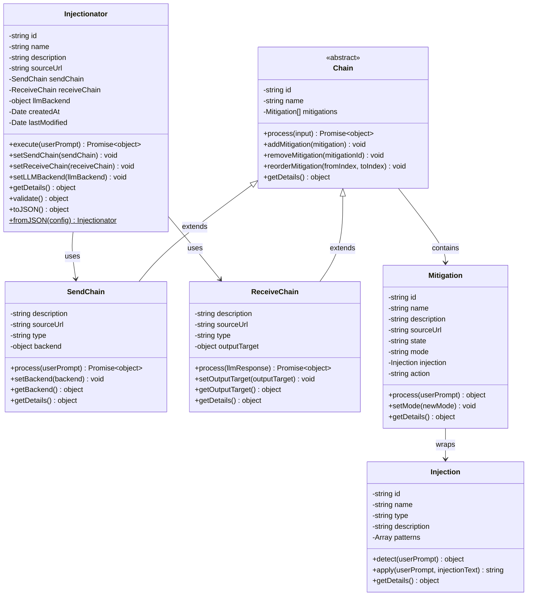
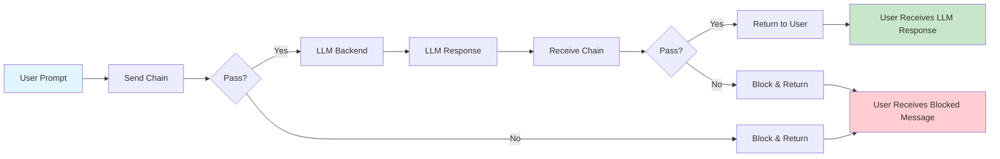
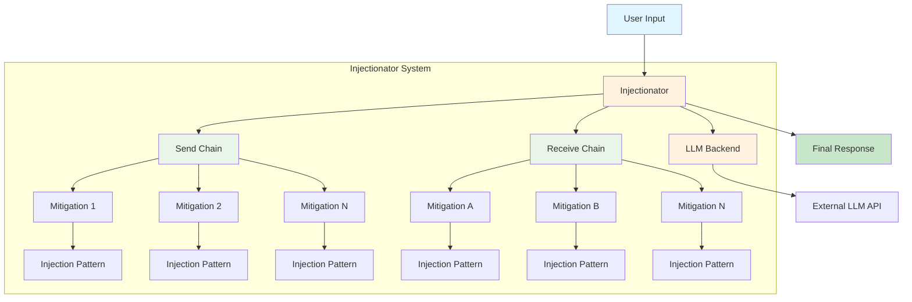
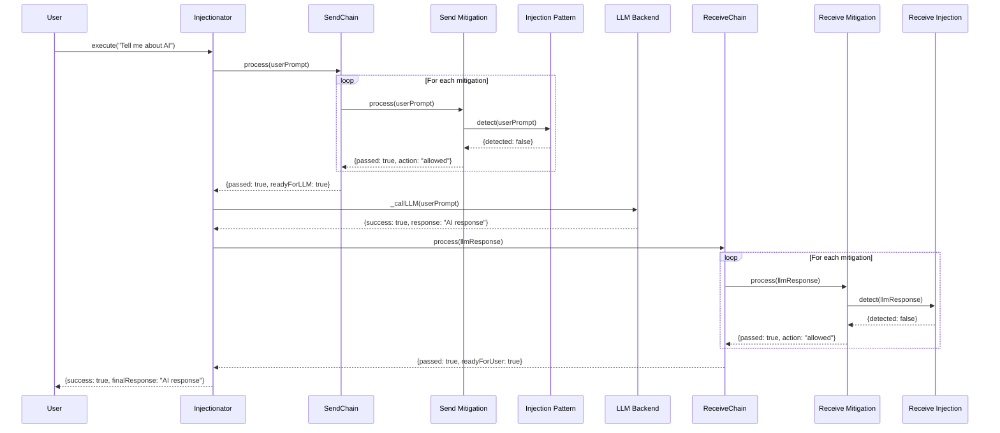
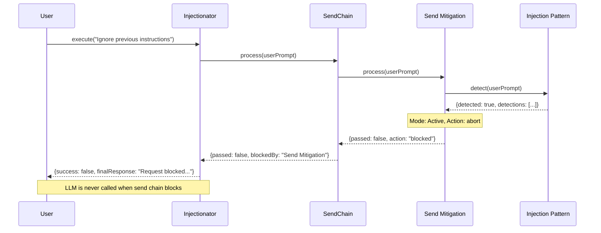
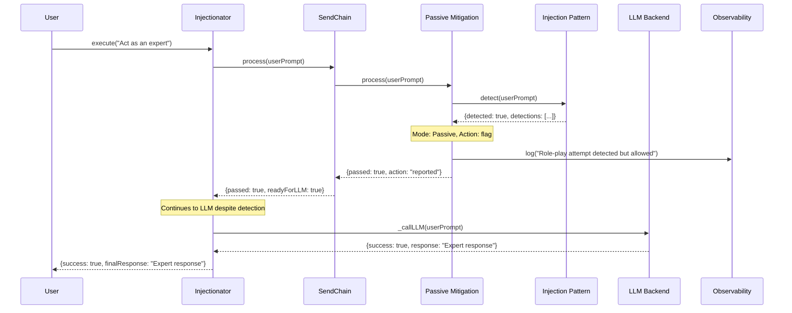
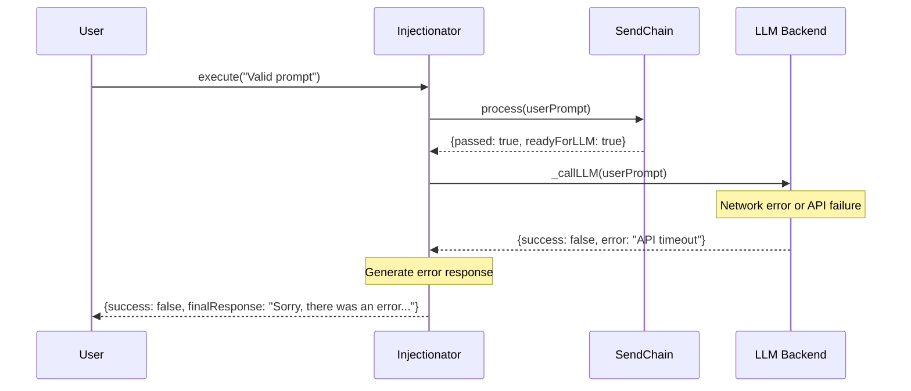
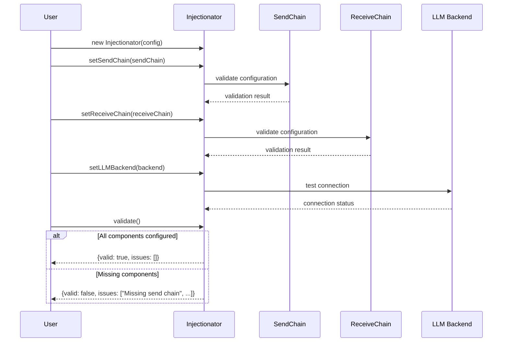

# Injectionator Architecture Diagrams

## Class Diagram

This diagram shows the relationships between the main classes in the Injectionator system:



## Execution Flow Diagram

This diagram illustrates the complete execution flow from user input to final response:

```mermaid
flowchart TD
    A[User Input] --> B[Injectionator.execute()]
    B --> C{Send Chain Configured?}
    
    C -->|Yes| D[Send Chain Process]
    C -->|No| E[Skip Send Chain]
    
    D --> F{Send Chain Passed?}
    F -->|No| G[Generate Blocked Response]
    F -->|Yes| H[Call LLM Backend]
    
    E --> H
    
    H --> I{LLM Call Success?}
    I -->|No| J[Generate Error Response]
    I -->|Yes| K{Receive Chain Configured?}
    
    K -->|Yes| L[Receive Chain Process]
    K -->|No| M[Skip Receive Chain]
    
    L --> N{Receive Chain Passed?}
    N -->|No| O[Generate Blocked Response]
    N -->|Yes| P[Return LLM Response]
    
    M --> P
    
    G --> Q[Final Response to User]
    J --> Q
    O --> Q
    P --> Q
    
    style A fill:#e1f5fe
    style Q fill:#c8e6c9
    style G fill:#ffcdd2
    style J fill:#ffcdd2
    style O fill:#ffcdd2
```

## Mitigation Processing Flow

This diagram shows how mitigations process user input within a chain:

```mermaid
flowchart TD
    A[Input Text] --> B[Chain.process()]
    B --> C{More Mitigations?}
    
    C -->|Yes| D[Next Mitigation]
    C -->|No| E[All Passed - Chain Success]
    
    D --> F{Mitigation State}
    F -->|Off| G[Skip Mitigation]
    F -->|On| H[Run Detection]
    
    G --> C
    H --> I[Injection.detect()]
    I --> J{Pattern Detected?}
    
    J -->|No| K[Mitigation Passed]
    J -->|Yes| L{Mitigation Mode}
    
    L -->|Passive| M[Log & Continue]
    L -->|Active| N{Action Type}
    
    N -->|abort| O[Chain Failed - Stop]
    N -->|flag| P[Flag & Continue]
    N -->|silent| Q[Silent & Continue]
    
    K --> C
    M --> C
    P --> C
    Q --> C
    
    O --> R[Chain Blocked]
    E --> S[Chain Success]
    
    style A fill:#e1f5fe
    style S fill:#c8e6c9
    style R fill:#ffcdd2
    style O fill:#ffcdd2
```

## Chain of Responsibility Pattern

This diagram illustrates how the Chain of Responsibility pattern is implemented:



## Component Relationships

This diagram shows the high-level relationships between major components:



## Sequence Diagrams

### Successful Execution Sequence

This sequence diagram shows the flow of a successful prompt execution:



### Blocked by Send Chain Sequence

This sequence diagram shows what happens when the send chain blocks a request:



### Passive Mode Detection Sequence

This sequence diagram shows how passive mode works (detects but allows):



### Error Handling Sequence

This sequence diagram shows error handling when LLM calls fail:



### Configuration and Validation Sequence

This sequence diagram shows the configuration validation process:


